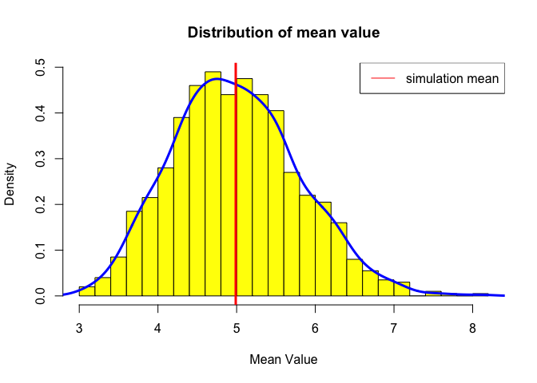

Statistical Inference
=====================
**Objective - Simulation exercise**

The exponential distribution can be simulated in R with rexp(n, lambda) where lambda is the rate parameter. The mean of exponential distribution is 1/lambda and the standard deviation is also also 1/lambda. Set lambda = 0.2 for all of the simulations. In this simulation, you will investigate the distribution of averages of 40 exponential(0.2)s. Note that you will need to do a thousand or so simulated averages of 40 exponentials.

Illustrate via simulation and associated explanatory text the properties of the distribution of the mean of 40 exponential(0.2)s.


```r
set.seed(40)
lambda <- 0.2
samplesize <- 40 #40 is sample size
simulations <- 1000 #we will perform 1000 simulations

#generate simulations
simulated_matrix <- matrix(rexp(samplesize * simulations, rate=lambda), nrow=simulations, ncol=samplesize)

#calculate and save mean of 40 samples per simulation
row_meanvalue <- rowMeans(simulated_matrix)
```

**1. Show where the distribution is centered at and compare it to the theoretical center of the distribution.**

The theoretical mean/center of the distribution is: 5

The simulated mean/center of the distribution is:
4.989

Therefore, the simulated mean is very close to the theoretical mean.

Following histogram shows the distribution of mean based on simulations.


```r
hist(row_meanvalue,
     col="yellow",
     breaks=20,
     main="Distribution of mean value",
     xlab="Mean Value",
     prob=TRUE)

lines(density(row_meanvalue), col="blue", lwd=3)
abline(v=mean(row_meanvalue), col="red", lwd=3)

legend('topright', c("simulation mean"), lty=1, col=c("red"))
```

 

**2. Show how variable it is and compare it to the theoretical variance of the distribution.**

* Standard deviation:
    + Theoretical value: 0.791
    + Simulated value: 0.802

* Variance:
    + Theoretical value: 0.625
    + Simulated value: 0.643

Therefore, as you can see, the standard deviation and variance of simulations is very close to theoretical values.

**3. Show that the distribution is approximately normal.**

We will use 2 different methods to show the distribution is approximately normal.

Method #1: According to the Central Limit Theorem, the averages of samples follow normal distribution. We will visually compare shapes of distribution of a large collection of random exponentials with distribution of averages of 40 exponential (0.2)s. For the sake of consistency, we will use the same lambda value of 0.2 in both distributions. The first graph, on left, shows a skewed distribution. The second graph, on right, shows a normal curve.

```r
par(mfrow=c(1,2))
hist(simulated_matrix,
     col="grey",
     breaks=20,
     main="Skewed distribution",
     xlab="Value",
     prob=TRUE)
lines(density(simulated_matrix), col="blue", lwd=5)

hist(row_meanvalue,
     col="grey",
     breaks=20,
     main="Approx. normal distribution",
     xlab="Value",
     prob=TRUE)
lines(density(row_meanvalue), col="blue", lwd=5)
```

 

Method #2: Use QQPlot to see whether data is normally distributed. Most data fall on the line on the QQ plot, but then both ends tail off a bit. The data isn't perfectly normal, but the QQ Plot shows that normality is a pretty good approximation. 


```r
qqnorm(row_meanvalue, 
       col="magenta",
       main="QQ Plot")
qqline(row_meanvalue, col="black")
```

 

End of document
===============
